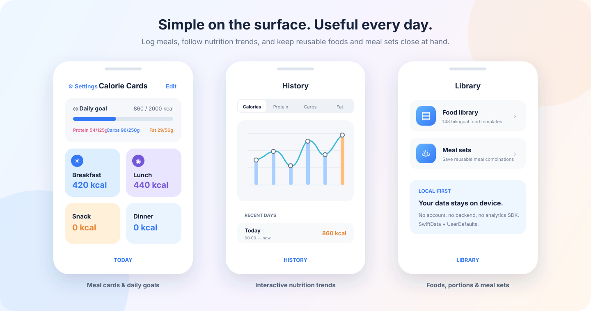

<div align="center">
  
  <h1>Calorie Cards</h1>
  <p>A local-first iOS nutrition tracker built around simple, flexible meal cards.</p>

  <p>
    
    
    
    
  </p>
</div>

Calorie Cards is a lightweight calorie and macronutrient tracker for iPhone and iPad. Instead of a long daily log, food is organised into visual cards such as Breakfast, Lunch, Snack, and Dinner. Cards can be renamed, reordered, recoloured, or replaced to match a personal routine.

The app tracks calories, protein, carbohydrates, and fat without requiring an account or network connection. Food templates, meal sets, daily records, goals, and preferences remain on the device.



## Features

- **Meal cards** — record food and reusable meal sets inside customisable cards.
- **Daily nutrition goals** — see calorie and macro progress at a glance.
- **Food library** — search, pin, add, edit, and remove food templates.
- **Reusable meal sets** — group several foods into a meal that can be added in one step.
- **Nutrition history** — inspect recent calorie, protein, carbohydrate, and fat trends with an interactive chart.
- **Custom day boundary** — choose when a tracking day ends, useful for late nights and non-standard schedules.
- **BMR and daily target calculator** — estimate energy needs using the Mifflin–St Jeor equation and apply the result as a goal.
- **English and Simplified Chinese** — interface text and the built-in food library support both languages.
- **Local-first storage** — no login, backend service, advertisements, or third-party analytics SDK.

The bundled library currently contains 148 common foods across dairy and eggs, fish, fruit, meat, nuts, seasonings, and vegetables. Quantities can be recorded per item, per 100 g, or per 100 ml.

## Technology

| Area | Implementation |
| --- | --- |
| Interface | SwiftUI |
| Food and meal-set storage | SwiftData |
| Daily cards and history | Codable models stored in `UserDefaults` |
| Goals and preferences | `AppStorage` |
| Charts | Swift Charts |
| Localisation | String Catalog (`.xcstrings`) |
| Dependencies | Apple frameworks only |

The data model intentionally separates reusable library data from daily snapshots. `FoodTemplate` and `MealSet` are stored with SwiftData, while a `FoodPortion` copied into a card keeps its own nutrition values. Editing a library entry therefore does not silently rewrite past records.

## Project structure

```text
CalorieCards
├── App/                         App entry point and bootstrap work
├── Data/
│   ├── Models/                  Cards, foods, portions, meal sets, history
│   ├── Services/                Day-cycle, persistence, history, seed import
│   └── Views/
│       ├── Today/               Daily cards, goals, settings, calculator
│       ├── History/             Charts and historical records
│       └── Library/             Foods and reusable meal sets
├── Resources/
│   ├── FoodSeeds/               Bundled bilingual food data
│   └── Localizable.xcstrings    English and Simplified Chinese strings
└── Assets.xcassets/             App icon and asset catalogue
```

## Requirements

- macOS with Xcode 16.4 or later
- iOS 18.5 or later
- An iPhone/iPad device or an installed iOS Simulator runtime

## Run locally

1. Clone the repository:

   ```bash
   git clone https://github.com/WangTairan/iOS_CalorieCards.git
   cd iOS_CalorieCards
   ```

2. Open `CalorieCards.xcodeproj` in Xcode.
3. Select the **CalorieCards** scheme and an iOS destination.
4. Build and run with <kbd>⌘R</kbd>.

There are no packages to install and no API keys or environment files to configure. Xcode may ask you to select your own development team when running on a physical device.

## Data and privacy

Calorie Cards does not include a server component. The app stores its data in the local SwiftData container and `UserDefaults`. Deleting the app also removes its locally stored data unless it is restored through an operating-system backup.

The nutrition values included with the project are general reference data. They can vary by product, preparation method, and serving size; the app is not intended to provide medical advice.

## Project status

This is a finished personal project and is no longer under active development.

## License

Calorie Cards is available under the [MIT License](LICENSE).
